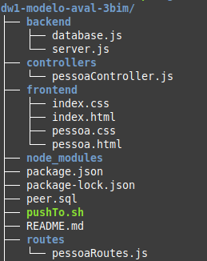

# Exemplo que mostra um server.js com múltiplos arquivos para diminuir a complexidade

separa cada rota em um arquivo diferente

foi implementado apenas pessoa, mas a ideia é organizar de forma mais adequada

--- 

prompt inicial (deepseek)

tenho um arquivo server.js
ele está ficando grande demais
tem como dividir o arquivo, por exemplo, varias rotas tratam do mesmo crud, como reorganizar com algo do tipo

server.js
      serverPessoa.js
      serverProduto.js

onde server.js importa serverPessoa.js

sugira boas práticas e de exemplos simples
